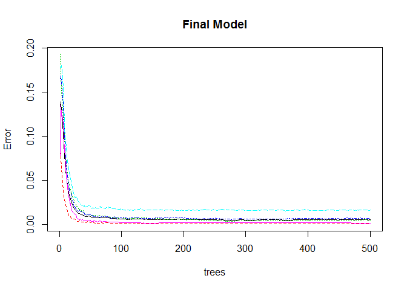
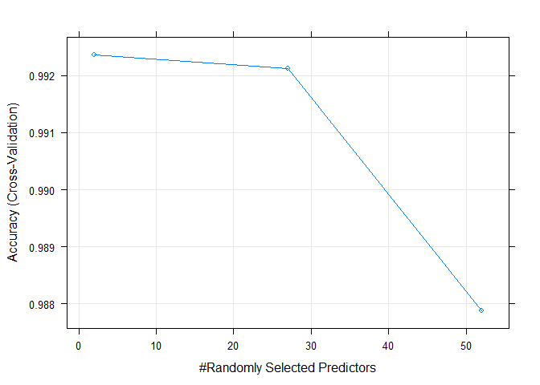

# Practical Machine Learning Course Project
Raju Gupta  
November 26, 2017  

# Human Activity Recognition - Predicting Weight Lifting Exercise Correctness 

## Introduction

Using devices such as Jawbone Up, Nike FuelBand, and Fitbit it is now possible to collect a large amount of data about personal activity relatively inexpensively. One thing that people regularly do is quantify *how much of a particular activity they do*, but they rarely quantify *how well they do it*. In this project, the goal is to use data from accelerometers on the belt, forearm, arm, and dumbell of 6 participants. They were asked to perform barbell lifts correctly and incorrectly in 5 different ways. More information is available from the website here: http://groupware.les.inf.puc-rio.br/har (see the section on the Weight Lifting Exercise Dataset).

## About Dataset

The data for this project come from http://groupware.les.inf.puc-rio.br/har. I heartfully thank the generousity of the website for providing the data for this research project.

## Objective

The Objective is to predict the manner in which the exercise is done. This is the "classe" variable in the training set. Describe how model is built, cross-validated, and how out of sample error is calculated. Lastly, predict 20 different test cases using prediction model.

## Data Pre-Processing

### Downloading the datasets


```r
trainurl <- "http://d396qusza40orc.cloudfront.net/predmachlearn/pml-training.csv"
testurl <- "http://d396qusza40orc.cloudfront.net/predmachlearn/pml-testing.csv"

setInternet2(FALSE)
f_train <- "pml-training.csv"
if(!file.exists(f_train)) {
    download.file(url=trainurl,destfile = f_train, mode = "wb")
}

f_test <- "pml-testing.csv"
if(!file.exists(f_test)) {
    download.file(url=testurl,destfile = f_test, mode = "wb")
}

#### Read the Data File
training <- read.csv(f_train, na.strings=c("NA",""))

### Exploratory Analysis
table(colSums(is.na(training)))
```

```
## 
##     0 19216 
##    60   100
```
Means there are 60 columns with no NAs and 100 columns with 19216 (~98%) NAs out of 19622 rows. So, we simply remove those columns with 98% NAs.


### Cleaning the data

```r
training <- training[, colSums(is.na(training)) == 0]   # Keeping predictors without NAs
```
Removing the first seven predictors, as index, name, date-time stamp are obviously unrelated to the outcome classe

```r
trainData <- training[, -c(1:7)]
dim(trainData)
```

```
## [1] 19622    53
```
The cleaned data set trainData has 53 columns and 19622 rows with the last variable classe

## Partioning the training set for cross-validation
In order to estimate the out-of-sample-error through cross-validation, it requires the training dataset to be partitioned into training and validation set. Since we already have sufficient training data (~19000 sample rows), we can keep 10% for validation and rest for training data. Count of 1900 samples for validation is fairly fine to estimate the out-of-sample-error.


```r
library(caret)
set.seed(10)
inTrain <- createDataPartition(trainData$classe, p = 0.9, list = FALSE)
trainset <- trainData[inTrain, ]
validationset <- trainData[-inTrain, ]
dim(trainset); dim(validationset)
```

```
## [1] 17662    53
```

```
## [1] 1960   53
```

## Prediction Modelling
This is a typical case of classification modelling. So we will try a Decision tree and Random forest for modelling.

### Decision Tree
We will choose a k-fold cross validation with k being 4 (default is 10). Here, the number of folds equal 4 and number of resampling iterations (or repeats) is equal to 1 (default). It will hopefully generate a reasonably good predictive algorithm on the cost of taking a little less time in comparison to what it would have taken with default values. Since data transformations may be less important in non-linear models like decision trees, we do not transform any variables.

```r
library(rpart)
control <- trainControl(method = "cv", number = 4)
dt_model <- train(classe ~ ., data = trainset, method = "rpart", trControl = control)
dt_model
```

```
## CART 
## 
## 17662 samples
##    52 predictor
##     5 classes: 'A', 'B', 'C', 'D', 'E' 
## 
## No pre-processing
## Resampling: Cross-Validated (4 fold) 
## Summary of sample sizes: 13247, 13245, 13247, 13247 
## Resampling results across tuning parameters:
## 
##   cp          Accuracy   Kappa     
##   0.03544304  0.5232141  0.38199628
##   0.05936181  0.3965614  0.17644617
##   0.11471519  0.3240246  0.06069239
## 
## Accuracy was used to select the optimal model using  the largest value.
## The final value used for the model was cp = 0.03544304.
```
It is evident that decision tree is performing poorly on the training data itself. Still no harm in verifying the accuracy from the validation data.

```r
# predict outcomes using validation set
dt_prediction <- predict(dt_model, validationset)
# Show prediction result
dt_cm <- confusionMatrix(dt_prediction, validationset$classe)
dt_cm
```

```
## Confusion Matrix and Statistics
## 
##           Reference
## Prediction   A   B   C   D   E
##          A 510 145 162 133  53
##          B   4 146  10  65  44
##          C  40  88 170 123  92
##          D   0   0   0   0   0
##          E   4   0   0   0 171
## 
## Overall Statistics
##                                          
##                Accuracy : 0.5087         
##                  95% CI : (0.4863, 0.531)
##     No Information Rate : 0.2847         
##     P-Value [Acc > NIR] : < 2.2e-16      
##                                          
##                   Kappa : 0.3583         
##  Mcnemar's Test P-Value : NA             
## 
## Statistics by Class:
## 
##                      Class: A Class: B Class: C Class: D Class: E
## Sensitivity            0.9140  0.38522  0.49708   0.0000  0.47500
## Specificity            0.6484  0.92220  0.78801   1.0000  0.99750
## Pos Pred Value         0.5085  0.54275  0.33138      NaN  0.97714
## Neg Pred Value         0.9498  0.86221  0.88113   0.8362  0.89412
## Prevalence             0.2847  0.19337  0.17449   0.1638  0.18367
## Detection Rate         0.2602  0.07449  0.08673   0.0000  0.08724
## Detection Prevalence   0.5117  0.13724  0.26173   0.0000  0.08929
## Balanced Accuracy      0.7812  0.65371  0.64254   0.5000  0.73625
```
Accuracy through confusion matrix is depicting to be 0.5086735, which is pretty poor. The out-of-sample error in decision tree case is 0.4913265. So, let's try Random Forests.

### Random Forest
Here also training with cross-validation with K-Fold (k=4) and repeat=1.

```r
library(randomForest)
#rf_model <- randomForest(classe ~ ., data = trainset) # provision for setting ntree & mtry, 
                                                # but no provision for K-fold cross-validation
rf_model <- train(classe ~ ., data = trainset, method = "rf", trControl = control)
rf_model
```

```
## Random Forest 
## 
## 17662 samples
##    52 predictor
##     5 classes: 'A', 'B', 'C', 'D', 'E' 
## 
## No pre-processing
## Resampling: Cross-Validated (4 fold) 
## Summary of sample sizes: 13247, 13249, 13245, 13245 
## Resampling results across tuning parameters:
## 
##   mtry  Accuracy   Kappa    
##    2    0.9923568  0.9903310
##   27    0.9921302  0.9900447
##   52    0.9878836  0.9846719
## 
## Accuracy was used to select the optimal model using  the largest value.
## The final value used for the model was mtry = 2.
```

```r
rf_prediction <- predict(rf_model, validationset)
rf_cm <- confusionMatrix(rf_prediction, validationset$classe)
rf_cm
```

```
## Confusion Matrix and Statistics
## 
##           Reference
## Prediction   A   B   C   D   E
##          A 558   1   0   0   0
##          B   0 378   2   0   0
##          C   0   0 340   3   0
##          D   0   0   0 318   1
##          E   0   0   0   0 359
## 
## Overall Statistics
##                                           
##                Accuracy : 0.9964          
##                  95% CI : (0.9927, 0.9986)
##     No Information Rate : 0.2847          
##     P-Value [Acc > NIR] : < 2.2e-16       
##                                           
##                   Kappa : 0.9955          
##  Mcnemar's Test P-Value : NA              
## 
## Statistics by Class:
## 
##                      Class: A Class: B Class: C Class: D Class: E
## Sensitivity            1.0000   0.9974   0.9942   0.9907   0.9972
## Specificity            0.9993   0.9987   0.9981   0.9994   1.0000
## Pos Pred Value         0.9982   0.9947   0.9913   0.9969   1.0000
## Neg Pred Value         1.0000   0.9994   0.9988   0.9982   0.9994
## Prevalence             0.2847   0.1934   0.1745   0.1638   0.1837
## Detection Rate         0.2847   0.1929   0.1735   0.1622   0.1832
## Detection Prevalence   0.2852   0.1939   0.1750   0.1628   0.1832
## Balanced Accuracy      0.9996   0.9980   0.9961   0.9950   0.9986
```
Random Forest's Accuracy through confusion matrix is 0.9964286, which is much better than that of Decision Tree. The out-of-sample error for Random Forest is 0.0035714. Random forests chooses a subset of predictors at each split and de-correlate them with each other. This leads to high accuracy, although this algorithm is sometimes difficult to interpret and computationally inefficient (slow).

# Final Model


```r
rf_model$finalModel
```

```
## 
## Call:
##  randomForest(x = x, y = y, mtry = param$mtry) 
##                Type of random forest: classification
##                      Number of trees: 500
## No. of variables tried at each split: 2
## 
##         OOB estimate of  error rate: 0.5%
## Confusion matrix:
##      A    B    C    D    E  class.error
## A 5020    1    0    0    1 0.0003982477
## B   11 3402    5    0    0 0.0046811001
## C    0   19 3059    2    0 0.0068181818
## D    0    0   45 2849    1 0.0158894646
## E    0    0    0    4 3243 0.0012319064
```

```r
plot(rf_model$finalModel, main = "Final Model")
```

<!-- -->

```r
plot(rf_model)
```

<!-- -->

# Predicting Test Set / Quiz

Using Random Forest model to predict test set

```r
# Reading test set data file
testing <- read.csv(f_test, na.strings=c("NA",""))
testing <- testing[, names(trainData)[1:length(trainData)-1]]   # Keep same cols for test & train
predict(rf_model, testing)
```

```
##  [1] B A B A A E D B A A B C B A E E A B B B
## Levels: A B C D E
```
